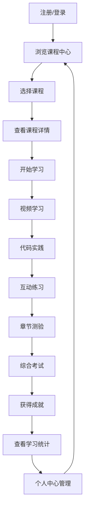

## 1. Product Overview
基于Python的数据分析在线教育平台，专为商务数据分析与应用专业学生设计。
- 提供完整的课程体系、互动式学习模块、练习测评和成就激励系统
- 帮助学生掌握数据分析技能，提升就业竞争力

## 2. Core Features

### 2.1 User Roles
| 角色 | 注册方式 | 核心权限 |
|------|---------------------|------------------|
| 学生 | 邮箱注册 | 浏览课程、学习内容、完成练习、参加测评、查看成就 |
| 管理员 | 后台创建 | 管理课程、用户、内容、系统设置 |

### 2.2 Feature Module
1. **首页**: 英雄区、导航栏、课程推荐、学习进度、成就展示
2. **课程中心**: 课程列表、课程详情、章节内容
3. **学习模块**: 视频学习、代码实践、互动练习
4. **测评系统**: 章节测验、综合考试、成绩分析
5. **成就中心**: 徽章系统、学习统计、排行榜
6. **个人中心**: 个人信息、学习记录、设置

### 2.3 Page Details
| 页面名称 | 模块名称 | 功能描述 |
|-----------|-------------|---------------------|
| 首页 | 英雄区 | 展示平台核心价值、吸引用户注册 |
| 首页 | 导航栏 | 提供平台各功能模块的快速访问 |
| 首页 | 课程推荐 | 根据用户兴趣和学习进度推荐相关课程 |
| 首页 | 学习进度 | 展示用户当前学习状态和完成情况 |
| 首页 | 成就展示 | 展示用户获得的徽章和成就 |
| 课程中心 | 课程列表 | 分类展示所有课程，支持筛选和搜索 |
| 课程中心 | 课程详情 | 展示课程介绍、大纲、讲师信息、评价 |
| 课程中心 | 章节内容 | 展示课程各章节的学习内容 |
| 学习模块 | 视频学习 | 提供高清视频课程，支持倍速、字幕 |
| 学习模块 | 代码实践 | 提供在线Python编程环境，支持代码运行和测试 |
| 学习模块 | 互动练习 | 提供基于知识点的练习题，支持即时反馈 |
| 测评系统 | 章节测验 | 每个章节结束后提供测验，检验学习效果 |
| 测评系统 | 综合考试 | 课程结束后提供综合考试，评估整体掌握程度 |
| 测评系统 | 成绩分析 | 提供详细的成绩报告和学习建议 |
| 成就中心 | 徽章系统 | 根据学习进度和表现颁发不同等级的徽章 |
| 成就中心 | 学习统计 | 展示学习时长、完成课程数等统计数据 |
| 成就中心 | 排行榜 | 展示用户在平台的排名情况 |
| 个人中心 | 个人信息 | 管理用户基本信息和账号设置 |
| 个人中心 | 学习记录 | 查看历史学习记录和进度 |
| 个人中心 | 设置 | 管理账号安全、通知偏好等 |

## 3. Core Process
用户主要操作流程：
1. 用户注册/登录平台
2. 浏览课程中心，选择感兴趣的课程
3. 进入课程详情页，查看课程信息并开始学习
4. 在学习模块中观看视频、进行代码实践和完成互动练习
5. 完成章节测验和综合考试
6. 获得成就和徽章，查看学习统计和排行榜
7. 在个人中心管理个人信息和学习记录

## 4. User Interface Design
### 4.1 Design Style
- 主色调：蓝色(#1E40AF)和橙色(#F97316)，代表专业和活力
- 按钮样式：圆角矩形，有轻微的阴影效果
- 字体：标题使用Inter，正文使用Roboto
- 字体大小：标题24-32px，副标题18-24px，正文14-16px
- 布局风格：卡片式布局，清晰的视觉层次
- 图标风格：线性图标，简洁现代

### 4.2 Page Design Overview
| 页面名称 | 模块名称 | UI元素 |
|-----------|-------------|-------------|
| 首页 | 英雄区 | 大型背景图，突出平台名称和核心价值，包含注册/登录按钮 |
| 首页 | 导航栏 | 固定顶部，包含logo、主要导航链接和用户头像 |
| 首页 | 课程推荐 | 卡片式布局，展示课程封面、名称、评分和简短描述 |
| 首页 | 学习进度 | 进度条和百分比显示，清晰直观 |
| 首页 | 成就展示 | 徽章图标和获得日期，排列成网格 |
| 课程中心 | 课程列表 | 响应式网格布局，支持卡片和列表视图切换 |
| 课程中心 | 课程详情 | 顶部banner，课程信息区，章节列表，评价区 |
| 学习模块 | 视频学习 | 大型视频播放器，下方是课程笔记和讨论区 |
| 学习模块 | 代码实践 | 代码编辑器和运行结果区域，支持语法高亮 |
| 学习模块 | 互动练习 | 问题展示区，选项/输入区，提交按钮和即时反馈 |
| 测评系统 | 章节测验 | 倒计时，问题导航，答题区，提交按钮 |
| 测评系统 | 综合考试 | 类似章节测验，但题目更多，时间更长 |
| 测评系统 | 成绩分析 | 分数展示，错题分析，知识点掌握情况图表 |
| 成就中心 | 徽章系统 | 徽章网格，点击可查看详细信息 |
| 成就中心 | 学习统计 | 图表展示学习时长、完成课程数等数据 |
| 成就中心 | 排行榜 | 表格形式，展示排名、用户名、分数等 |
| 个人中心 | 个人信息 | 表单形式，可编辑个人资料 |
| 个人中心 | 学习记录 | 时间线形式，展示学习历史 |
| 个人中心 | 设置 | 选项卡形式，分类展示各种设置选项 |

### 4.3 Responsiveness
- 设计采用桌面优先原则，同时适配平板和移动设备
- 在移动设备上，导航栏会变为汉堡菜单
- 卡片布局会根据屏幕宽度自动调整列数
- 视频播放器和代码编辑器会根据屏幕尺寸自适应调整大小
- 触摸设备优化：增大点击区域，支持手势操作

### 4.4 3D Scene Guidance
- 不适用，本项目不需要3D场景