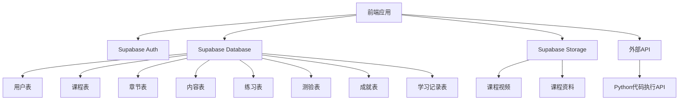
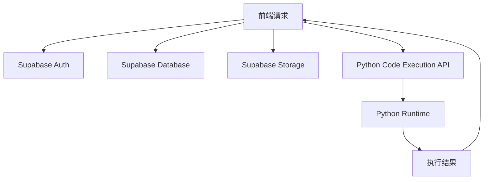
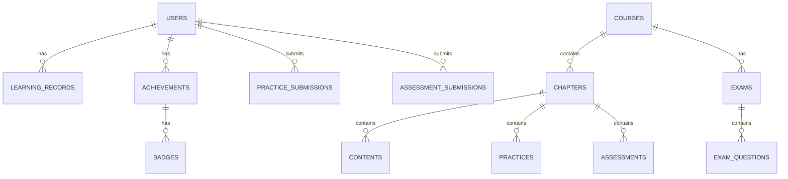

## 1. Architecture Design


## 2. Technology Description
- 前端：React@18 + TypeScript + Tailwind CSS@3 + Vite
- 初始化工具：vite-init
- 后端：Supabase (认证、数据库、存储)
- 数据库：Supabase (PostgreSQL)
- 外部服务：Python代码执行API (用于在线代码实践)

## 3. Route Definitions
| 路由 | 用途 |
|-------|---------|
| / | 首页 |
| /courses | 课程中心 |
| /courses/:id | 课程详情 |
| /learn/:courseId/:chapterId | 学习模块 |
| /assessment/:courseId/:chapterId | 章节测验 |
| /exam/:courseId | 综合考试 |
| /achievements | 成就中心 |
| /profile | 个人中心 |
| /login | 登录页 |
| /register | 注册页 |

## 4. API Definitions
### 4.1 Supabase Auth API
- 注册：`supabase.auth.signUp()`
- 登录：`supabase.auth.signInWithPassword()`
- 登出：`supabase.auth.signOut()`
- 获取当前用户：`supabase.auth.getUser()`

### 4.2 Supabase Database API
- 获取课程列表：`supabase.from('courses').select('*')`
- 获取课程详情：`supabase.from('courses').select('*').eq('id', courseId).single()`
- 获取章节内容：`supabase.from('chapters').select('*').eq('course_id', courseId)`
- 获取学习记录：`supabase.from('learning_records').select('*').eq('user_id', userId)`
- 提交练习答案：`supabase.from('practice_submissions').insert({...})`
- 提交测验答案：`supabase.from('assessment_submissions').insert({...})`
- 获取成就：`supabase.from('achievements').select('*').eq('user_id', userId)`

### 4.3 Python代码执行API
- 执行Python代码：`POST /api/execute-python`
  - 请求体：`{"code": "print('Hello World')"}`
  - 响应：`{"output": "Hello World", "error": null}`

## 5. Server Architecture Diagram


## 6. Data Model
### 6.1 Data Model Definition


### 6.2 Data Definition Language
```sql
-- 用户表
CREATE TABLE users (
  id UUID PRIMARY KEY REFERENCES auth.users(id),
  email TEXT UNIQUE NOT NULL,
  name TEXT,
  avatar_url TEXT,
  created_at TIMESTAMP DEFAULT NOW(),
  updated_at TIMESTAMP DEFAULT NOW()
);

-- 课程表
CREATE TABLE courses (
  id UUID PRIMARY KEY DEFAULT gen_random_uuid(),
  title TEXT NOT NULL,
  description TEXT,
  cover_image_url TEXT,
  difficulty TEXT,
  duration INTEGER,
  created_at TIMESTAMP DEFAULT NOW(),
  updated_at TIMESTAMP DEFAULT NOW()
);

-- 章节表
CREATE TABLE chapters (
  id UUID PRIMARY KEY DEFAULT gen_random_uuid(),
  course_id UUID REFERENCES courses(id),
  title TEXT NOT NULL,
  order_index INTEGER,
  created_at TIMESTAMP DEFAULT NOW(),
  updated_at TIMESTAMP DEFAULT NOW()
);

-- 内容表
CREATE TABLE contents (
  id UUID PRIMARY KEY DEFAULT gen_random_uuid(),
  chapter_id UUID REFERENCES chapters(id),
  type TEXT NOT NULL, -- video, text, code
  title TEXT NOT NULL,
  content TEXT,
  video_url TEXT,
  order_index INTEGER,
  created_at TIMESTAMP DEFAULT NOW(),
  updated_at TIMESTAMP DEFAULT NOW()
);

-- 练习表
CREATE TABLE practices (
  id UUID PRIMARY KEY DEFAULT gen_random_uuid(),
  chapter_id UUID REFERENCES chapters(id),
  title TEXT NOT NULL,
  description TEXT,
  type TEXT NOT NULL, -- multiple_choice, code, text
  question TEXT NOT NULL,
  options TEXT[],
  correct_answer TEXT,
  order_index INTEGER,
  created_at TIMESTAMP DEFAULT NOW(),
  updated_at TIMESTAMP DEFAULT NOW()
);

-- 测验表
CREATE TABLE assessments (
  id UUID PRIMARY KEY DEFAULT gen_random_uuid(),
  chapter_id UUID REFERENCES chapters(id),
  title TEXT NOT NULL,
  description TEXT,
  time_limit INTEGER, -- minutes
  passing_score INTEGER, -- percentage
  created_at TIMESTAMP DEFAULT NOW(),
  updated_at TIMESTAMP DEFAULT NOW()
);

-- 测验问题表
CREATE TABLE assessment_questions (
  id UUID PRIMARY KEY DEFAULT gen_random_uuid(),
  assessment_id UUID REFERENCES assessments(id),
  type TEXT NOT NULL, -- multiple_choice, true_false, text
  question TEXT NOT NULL,
  options TEXT[],
  correct_answer TEXT,
  points INTEGER,
  order_index INTEGER,
  created_at TIMESTAMP DEFAULT NOW(),
  updated_at TIMESTAMP DEFAULT NOW()
);

-- 考试表
CREATE TABLE exams (
  id UUID PRIMARY KEY DEFAULT gen_random_uuid(),
  course_id UUID REFERENCES courses(id),
  title TEXT NOT NULL,
  description TEXT,
  time_limit INTEGER, -- minutes
  passing_score INTEGER, -- percentage
  created_at TIMESTAMP DEFAULT NOW(),
  updated_at TIMESTAMP DEFAULT NOW()
);

-- 考试问题表
CREATE TABLE exam_questions (
  id UUID PRIMARY KEY DEFAULT gen_random_uuid(),
  exam_id UUID REFERENCES exams(id),
  type TEXT NOT NULL, -- multiple_choice, true_false, text, code
  question TEXT NOT NULL,
  options TEXT[],
  correct_answer TEXT,
  points INTEGER,
  order_index INTEGER,
  created_at TIMESTAMP DEFAULT NOW(),
  updated_at TIMESTAMP DEFAULT NOW()
);

-- 学习记录表
CREATE TABLE learning_records (
  id UUID PRIMARY KEY DEFAULT gen_random_uuid(),
  user_id UUID REFERENCES users(id),
  course_id UUID REFERENCES courses(id),
  chapter_id UUID REFERENCES chapters(id),
  content_id UUID REFERENCES contents(id),
  completed BOOLEAN DEFAULT false,
  completion_date TIMESTAMP,
  created_at TIMESTAMP DEFAULT NOW(),
  updated_at TIMESTAMP DEFAULT NOW()
);

-- 练习提交表
CREATE TABLE practice_submissions (
  id UUID PRIMARY KEY DEFAULT gen_random_uuid(),
  user_id UUID REFERENCES users(id),
  practice_id UUID REFERENCES practices(id),
  answer TEXT,
  correct BOOLEAN,
  submission_date TIMESTAMP DEFAULT NOW()
);

-- 测验提交表
CREATE TABLE assessment_submissions (
  id UUID PRIMARY KEY DEFAULT gen_random_uuid(),
  user_id UUID REFERENCES users(id),
  assessment_id UUID REFERENCES assessments(id),
  score INTEGER,
  passed BOOLEAN,
  submission_date TIMESTAMP DEFAULT NOW()
);

-- 考试提交表
CREATE TABLE exam_submissions (
  id UUID PRIMARY KEY DEFAULT gen_random_uuid(),
  user_id UUID REFERENCES users(id),
  exam_id UUID REFERENCES exams(id),
  score INTEGER,
  passed BOOLEAN,
  submission_date TIMESTAMP DEFAULT NOW()
);

-- 成就表
CREATE TABLE achievements (
  id UUID PRIMARY KEY DEFAULT gen_random_uuid(),
  user_id UUID REFERENCES users(id),
  type TEXT NOT NULL, -- course_completion, streak, points
  name TEXT NOT NULL,
  description TEXT,
  badge_url TEXT,
  unlocked_at TIMESTAMP DEFAULT NOW()
);

-- 徽章表
CREATE TABLE badges (
  id UUID PRIMARY KEY DEFAULT gen_random_uuid(),
  name TEXT NOT NULL,
  description TEXT,
  image_url TEXT,
  requirement TEXT NOT NULL,
  created_at TIMESTAMP DEFAULT NOW()
);

-- 索引
CREATE INDEX idx_users_email ON users(email);
CREATE INDEX idx_courses_difficulty ON courses(difficulty);
CREATE INDEX idx_chapters_course_id ON chapters(course_id);
CREATE INDEX idx_contents_chapter_id ON contents(chapter_id);
CREATE INDEX idx_practices_chapter_id ON practices(chapter_id);
CREATE INDEX idx_assessments_chapter_id ON assessments(chapter_id);
CREATE INDEX idx_learning_records_user_id ON learning_records(user_id);
CREATE INDEX idx_learning_records_course_id ON learning_records(course_id);
CREATE INDEX idx_practice_submissions_user_id ON practice_submissions(user_id);
CREATE INDEX idx_assessment_submissions_user_id ON assessment_submissions(user_id);
CREATE INDEX idx_exam_submissions_user_id ON exam_submissions(user_id);
CREATE INDEX idx_achievements_user_id ON achievements(user_id);

-- 权限设置
GRANT SELECT ON users, courses, chapters, contents, practices, assessments, assessment_questions, exams, exam_questions, badges TO anon;
GRANT ALL PRIVILEGES ON users, learning_records, practice_submissions, assessment_submissions, exam_submissions, achievements TO authenticated;
```